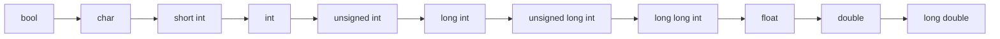
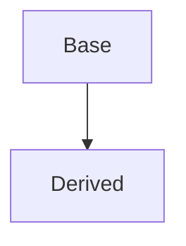

# Casting
- casts allow us to :

work with raw memory.
navigate inheritance hierarchy

# Implicit type conversion

| Assignment | Value |
|------------|-------|
| **float** f = -42.1234; | -42.1234016 (**-42.1234** is a double converted to a float in the memory)
| **double** d = f        | -42.123401641845703 |
| **int** i = f           | -42  (bye **fractional** part)|
| **size_t** s = f           | 18446744073709551574 (**-42.1234** is assigned to **unsigned long**) |


C++ will allow us convert values of one fundamental type to another fundamental type. 
The process of converting a value from one type to another type is called **type conversion**.
When the compiler does type conversion on our behalf without us explicitly asking, 
we call this **implicit type conversion**. 
   ```cpp
#include <iostream>

void print(double x) { std::cout << x; }

int main() { print(5); }
```

>the int argument `5` will be converted to double value `5.0`
>and then copied into parameter `x`.

- Order of the typecast to avoid data lost:


# explicit type conversion 

## 1) cast operators :
### 1.1) C-style casts
```cpp
struct tree {bool isLive = true;};
struct car {int model = 1982;};

car                     tree
+--------+              +--------+
|10111110|              |00000001|
|00000111|              |00000000|
|00000000|              |00000000|
|00000000|              |00000000|
+--------+              +--------+

void prune(tree *t){t->isLive = false;}
void drive(const car *c){std::cout << "MODEL : " << c->model;}

int main ()
{
	const tree t;
	car c;

	drive(&c); // OUT > MODEL : 1982
	prune((tree*) &t); // we cast our tree
	tree
	+--------+
      { |00000000| } <- false
	|00000000|
	|00000000|
	|00000000|
	+--------+
	drive((car*) &t); //with a cast from tree to car, we can diriving our tree!!
	        +--------+
      model ->  |00000000|
	        |00000000|
	        |00000000|
	        |00000000|
	        +--------+ 
	//OUT > MODEL : 0
	prune((tree*) &c);
	car                   c->isLive = false;
	+--------+             +--------+ 
	|10111110|             |00000000| 
	|00000111|             |00000111| 
	|00000000|             |00000000|   
	|00000000|             |00000000|  
	+--------+             +--------+ 
    c-> model = 1982       c-> model = 1792
    drive(&c); // OUT > MODEL : 1792
}
```

In standard C programming, casts are done via the () operator, 
with the name of the type to convert the value placed inside the parenthesis.

```cpp
#include <iostream>

int main()
{
    int x = 10 ;
    int y = 4;

    double d { (double)x / y }; // d = 2.5 
// we can write :
    //double d { double(x) / y }; <=> { double(x) / (double)y }
    //double d { x / double(y) }; <=> { double(x) / (double)y }
    return 0;
}
```
> **Best practice**
Avoid using ~~C-style casts~~ !!
because it doesn't check casting and may allow a **dangerous cast** to happen.


### 1.2) static_cast
if we *intentionally* wanted to pass a double value to a function taking an integer?
> it might cause us to overlook some other warning that represents a serious **problem** !

**Explicit type conversion** allow us to explicitly tell the compiler
to convert a value from one type to another type.

> We take full **responsibility** for the result of that conversion.
#### Syntax :
```cpp
    static_cast<new_type>(expression)
 ```
 >**static_cast** takes the value from an expression as input, 
 >and returns that value converted into the type specified by _\<new type\>_
 >it happened on **the compile time**, so programmer has responsibility 
 >to check whether the type casting that correct or not.

#### Let’s update our prior program using  `static_cast`:
```cpp
#include <iostream>

void print(int x)
{
	std::cout << x;
}

int main()
{
	print( static_cast<int>(5.5) ); //explicitly convert double value 5.5 to an int

	return 0;
}
```
We explicitly converted double value `5.5`  to an `int` value.
> No compiler **warning**

#### Let’s convert `char` to `int` with `static_cast`:
```cpp
#include <iostream>

int main()
{
    char ch = 97; // 97 is ASCII code for 'a'
    std::cout << ch << '\n'; // >> Print a
    return 0;
}
```
#### print the integral value instead of the char :
```cpp
#include <iostream>

int main()
{
    char ch = 97; // 97 is ASCII code for 'a'
    std::cout << static_cast<int>(ch) << '\n'; // >> Print 97
    return 0;
}
```

**static_cast** does not protect against **downcasting** to an unrelated type
```cpp
struct Base { 
	virtual ~Base();
	virtual void fun() { std::cout << "Base\n";}
};
struct D1 : public Base {void fun() { std::cout << "D1\n";}};
struct D2 : public Base {void fun() { std::cout << "D2\n";}};

int main (){
	D1 d1;
	Base &b = d1;
	d1.fun(); // OUT : D1
	b.fun();  // OUT : D1
	D2 d2 = static_cast<D1>(&b);
	d2.fun(); // OUT : D1
	
}
```

### 1.3) Dynamic casting

```cpp
#include <iostream>
#include <string>

class Base
{
protected:
	int m_value;
public:
	Base(int value) : m_value(value) {}
	virtual ~Base() {}; // Dynamic casting require type to be polymorphic, at least one member virtual
};

class Derived : public Base
{
private:
	std::string m_name;
public:
	Derived(int value, const std::string &name) : Base(value), m_name(name) {} //parameterized constructor
	const std::string &getName() const { return m_name; }                      // geter()
};

int main()
{
	Base* base = new Derived(1, "Apple");
	std::cout << base->getName(); // ERROR : no member named 'getName' in 'Base'
	delete base;
	return 0;
}
```
- How would we call Derived::getName() ?

Yeah, we can add a **virtual function** to Base called **getName()**, 
but we just polluting our Base class with things that really should only be the concern of the Derived class.
The process of converting a *Derived pointer* into a *Base pointe*r called **" upcasting "**.
How can we convert a *Base pointer* back into a *Derived pointer*, to call **getName()** directly using that pointer?

**dynamic_cast**  can be used for just this purpose. 
The most common use for dynamic casting is for converting *base-class pointers* into *derived-class* pointers. 
This process is called  **downcasting**.

```cpp
int main()
{
	Base* base = new Derived(1, "Apple");
	Derived *driv = dynamic_cast<Derived *>(base); 
	
	// If a dynamic_cast fails, the result of the conversion will be a null pointer.
	if (driv != nullptr)
		std::cout << driv->getName();
	delete base;
	return 0;
}
```

> can only be a reference or pointer
> form must be polymorphic
> it is a **run time**, it check object types at run time.
> return **nullptr** for pointers or throw **std::bad_cast** for reference if the type are not related


### 1.4) reinterpret_cast

>shouldn't be using it, if you do it's up to you!

it's close to **C-style casts**, it called *type-punning*.
it can change any pointer/reference to any other pointer/reference.
does not ensure sizes of **To** and **From** are the same.

```cpp
int main ()
{
	int *ptr = new int(65);
	char *c = reinterpret_cast<char *>(ptr);

	ptr = 0xabc
	+--------+
        |01000001|
	|00000000|
	|00000000|
	|00000000|
	+--------+

	&c = 0xabc
	+--------+
      [ |01000001| ] <===> 'A'
	|00000000|
	|00000000|
	|00000000|
	+--------+
	std::cout << ptr;  //0xabc
	std::cout << c;    //A
    std::cout << *ptr; //65
    std::cout << *c;   //A
}
```


## 2 . assignment operators :
### 2.1) Overloading typecasts

C++ already knows how to convert between the built-in data types (int, double ...). 
However, it does not know how to convert any of our **user-defined classes**. 
> **User-defined conversions** allow us to convert our class into another data type

- without **overloading typecasting** :
 
```cpp
class Cents
{
private:
    int m_cents;
public:
    Cents(int cents=0) : m_cents( cents ) {}
    int getCents() const { return m_cents; }
};

#include <iostream>

void printInt(int value)
{
    std::cout << value << '\n';
}

int main()
{
    Cents cents(7);
    printInt(cents.getCents());
    return 0;
}
```

- with **overloading typecasting** :

This will allow us to cast our Cents class directly into an int.
```cpp
class Cents
{
private:
    int m_cents;
public:
    Cents(int cents=0) : m_cents( cents ) {}
	operator int() const { return m_cents; } 
	//User-defined conversions do not take parameters.
    //User-defined conversions do not have a return type
};

#include <iostream>

void printInt(int value)
{
    std::cout << value << '\n';
}

int main()
{
    Cents cents(7);
    printInt(cents);
    // OR
    int i = static_cast<int>(cents);
    return 0;
}
```

The compiler will first note that function *printInt()* takes an **integer parameter**. 
Then it will note that variable **cents** is not an int. 
Finally, it will look to see if we’ve provided a way to convert a Cents into an int.
it will call our **operator int()** function, which returns an **int**.

- We can now also explicitly cast our Cents variable to an int:
```cpp
    int i = static_cast<int>(cents);
```

- Conversions for any data type:

This allows us to convert a Dollars object directly into a Cents object.
```cpp
#include <iostream>

class Cents
{
private:
    int m_cents;
public:
    Cents(int cents=0) : m_cents( cents ){}
    // Overloaded int cast
    operator int() const { return m_cents; }
};

class Dollars
{
private:
    int m_dollars;
public:
    Dollars(int dollars=0) : m_dollars( dollars) {}
    // Allow us to convert Dollars into Cents
    operator Cents() const { return Cents { m_dollars * 100 }; }
};

void printCents(Cents cents)
{
    std::cout << cents << '\n'; // Print 900
}

int main()
{
    Dollars dollars(9);
    printCents(dollars); // dollars will be implicitly cast to a Cents here
    return 0;
}
```
